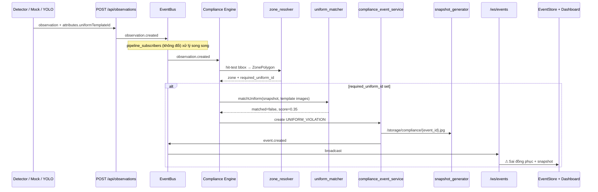

# AMS v1.7 — Compliance Engine Implementation Plan

> **Tín Nghĩa AMS** — AI Biosecurity Compliance System  
> **Phạm vi:** Uniform Template Manager · Zone → Uniform Mapping · Uniform Violation Detection · Snapshot Evidence  
> **Nguyên tắc:** Chỉ bổ sung — không refactor module ổn định, không thay đổi API hiện có.

**Trạng thái tài liệu:** Phân tích hoàn tất — **chưa triển khai code** (Bước 1).

---

## 0. Lưu ý về cấu trúc thư mục

Spec yêu cầu đọc `backend/src` và `frontend/src`. Trong repo thực tế:

| Spec | Thực tế trong repo |
|------|-------------------|
| `backend/src` | **`backend/app/`** — FastAPI (Python) |
| `frontend/src` | **`src/`** ở root repo — React (Vite) |

Backend **không phải Node.js**. Module Compliance Engine backend sẽ là **Python** tại `backend/app/compliance/`, không phải file `.js` trong `backend/src/`.

Frontend mirror (preview/dev) có thể đặt tại `src/core/compliance/` nếu cần — logic chính chạy trên backend.

---

## 1. Phân tích hệ thống hiện tại

### 1.1 Event model

**File:** `backend/app/models/event.py`

| Field | Mô tả |
|-------|--------|
| `id`, `farm_id`, `camera_id` | Định danh |
| `category` | Phân loại nguồn (`rule_engine`, `atsh_violation`, `improper_clothing`, …) — **không enum cứng** |
| `alert_type` | Nhãn hiển thị tiếng Việt |
| `zone`, `severity`, `status`, `handler`, `confidence` | UI / workflow |
| `occurred_at` | ISO timestamp |
| **Rule engine v1.3+** | `zone_id`, `rule_id`, `event_type`, `confidence_score`, `snapshot_url`, `event_metadata` |

**Snapshot evidence:** `backend/app/models/event_snapshot.py` — `image_path`, `thumbnail_path` → URL `/storage/{category}/{event_id}.jpg`

**Schema API:** `backend/app/schemas/event.py` (`EventResponse`, `EventEngineResponse`)

**Constants rule types (ZoneRule):** `backend/app/models/zone_rule.py` — `PERSON_ENTER`, `PPE_REQUIRED`, … — **không thêm type mới trong v1.7**.

---

### 1.2 Event pipeline

Hai pipeline **độc lập**, cùng ghi bảng `events`:

#### Pipeline A — Observation / Rule Engine (realtime dashboard dùng pipeline này)

```
POST /api/observations
  → observation_service.create_observation()
  → EventBus: observation.created
  → pipeline_subscribers.handle_observation_created()
       zone_mapper → TrackStore → track.updated
  → pipeline_subscribers.handle_track_updated()
       ZonePresenceTracker + ZoneRule eval
  → evaluator_event_service.create_event_from_evaluation()
       category=rule_engine, snapshot_url=None
  → EventBus: event.created
  → event_stream_service → /ws/events + /ws/dashboard
```

**Files then chốt:**
- `backend/app/services/observation_service.py`
- `backend/app/services/pipeline_subscribers.py`
- `backend/app/services/evaluator_event_service.py`
- `backend/app/core/event_bus/event_bus.py`
- `backend/app/core/event_bus/event_types.py`
- `backend/app/services/event_engine_service.py` (serialize WS payload)

**Startup:** `backend/app/main.py` → `register_pipeline_subscribers()` + `event_stream_service.register()`

#### Pipeline B — Zone Transition / ATSH (có snapshot, WS khác)

```
POST /api/transitions/cross
  → zone_crossing_engine → biosecurity_engine / workflow_engine
  → Event + EventSnapshot (snapshot_generator)
  → broadcast trực tiếp /ws/alerts (KHÔNG qua EventBus)
```

**v1.7 Compliance Engine gắn vào Pipeline A** (observation-driven, realtime) — **module subscriber riêng**, không sửa `pipeline_subscribers.py`.

---

### 1.3 Zone model (3 lớp — quan trọng cho v1.7)

| Model | Table | File | Dùng cho |
|-------|-------|------|----------|
| **ZonePolygon** | `zone_polygons` | `backend/app/models/zone_polygon.py` | Zone Designer ATSH (`/api/zones`) |
| **CameraZone** | `camera_zones` | `backend/app/models/camera_zone.py` | Rule engine + `zone_mapper` (observation) |
| **FarmZone** | `farm_zones` | `backend/app/models/farm_zone.py` | Smart Farm layout |

**ZoneRule** (`backend/app/models/zone_rule.py`) gắn **CameraZone**, không gắn ZonePolygon.

**Quyết định v1.7:**
- Cấu hình **Required Uniform** trên **ZonePolygon** (Zone Designer — đúng spec Bước 4/10).
- Compliance Engine **hit-test bbox** person vào `ZonePolygon.polygon_points` (cùng camera) — **không đụng** `zone_mapper` / CameraZone.
- Trường mới `required_uniform_id` **nullable** → tương thích ngược 100% zone cũ.

---

### 1.4 Camera model

**File:** `backend/app/models/camera.py`

- `id`, `farm_id`, `name`, `zone` (string label), RTSP fields, `status`, `is_active`
- API: `backend/app/api/cameras.py`
- Snapshot live: `camera_snapshot_service.py` → `uploads/snapshots/{camera_id}/`

Compliance Engine chỉ **đọc** camera (farm_id, name) — không sửa model Camera.

---

### 1.5 Dashboard realtime

**Central store:** `src/context/EventStore.jsx`
- Bootstrap REST: `GET /api/events` + `GET /api/cameras`
- WS: `subscribeWsEvents()` → `event.created` → `normalizeWsPayload()` → `applyEvent()`
- Metrics: `computeEventMetrics()` trong `src/utils/eventNormalizer.js`

**UI components:**
- `src/components/realtime/RealtimeEventFeed.jsx` — sidebar global (AppLayout)
- `src/components/realtime/RealtimeDashboardWidgets.jsx` — DashboardPage
- `src/pages/DashboardPage.jsx`, `src/pages/FarmControlDashboardPage.jsx`

**Tích hợp v1.7:** Event `UNIFORM_VIOLATION` publish qua `event.created` → EventStore **tự nhận** — chỉ cần bổ sung label/normalize, **không sửa wsClient hay EventStore core logic**.

---

### 1.6 WebSocket event flow

| Endpoint | File | Consumer |
|----------|------|----------|
| `/ws/events` | `backend/app/ws/event_gateway.py` | `wsClient.js` → EventStore |
| `/ws/dashboard` | `backend/app/api/realtime.py` | `useDashboardWebSocket.js` (phụ) |
| `/ws/alerts` | `backend/app/api/realtime.py` | Transition pipeline (ATSH) |

**Bridge EventBus → WS:** `backend/app/services/event_stream_service.py`

- Subscribe tất cả topics → forward `{ type, payload, timestamp }`
- `event.created` → frontend `EventStore` xử lý

**v1.7:** Compliance Engine publish `EVENT_CREATED` qua EventBus → **cùng luồng WS hiện có** — không endpoint mới, không polling.

---

### 1.7 Cấu trúc routing backend

**Entry:** `backend/app/main.py` — prefix `/api`, static `/storage`, `/uploads`

**Routers liên quan v1.7 (hiện có — không đổi behavior):**

| Router | Prefix | Ghi chú |
|--------|--------|---------|
| `observations.py` | `/api/observations` | Entry observation pipeline |
| `events.py` | `/api/events` | List events |
| `zones.py` | `/api/zones` | Zone Designer CRUD |
| `camera_zones.py` | `/api/cameras/{id}/zones` | Camera overlay zones |
| `snapshots.py` | `/api/snapshots` | List EventSnapshot |
| `compliance.py` | `/api/compliance` | ATSH score dashboard (REST) |
| `employees.py` | `/api/employees` | Pattern upload file → `/storage/employees/` |

**Routers mới v1.7 (additive):**

| Router | Prefix | Endpoints |
|--------|--------|-----------|
| `uniforms.py` *(mới)* | `/api/uniforms` | CRUD uniform templates |
| `zones.py` *(mở rộng)* | `/api/zones/{id}/uniform` | PUT mapping only |

---

### 1.8 Cấu trúc services frontend

**Base HTTP:** `src/services/apiClient.js` — Bearer token, `${API_BASE_URL}/api`

| Service | File | API |
|---------|------|-----|
| Events | `eventService.js` | `/events` |
| WebSocket | `wsClient.js` | `/ws/events` |
| Farm zones (Designer) | `farmZoneService.js` | `/zones` |
| Camera zones | `zoneService.js` | `/cameras/{id}/zones` |
| Observations | `observationService.js` | `/observations` |
| Cameras | `cameraService.js` | `/cameras` |

**Services mới v1.7:**
- `src/services/uniformService.js` — CRUD `/api/uniforms`

**UI stack:** Custom CSS (`App.css`, `ams-brand.css`) + Lucide icons — **không có Material UI** trong `package.json`. Trang mới giữ pattern `SettingsPage.jsx` / `AtshRulesPage.jsx`.

---

## 2. Kiến trúc AMS v1.7 — Compliance Engine

### 2.1 Mục tiêu

```
Person (observation)
  → Zone (ZonePolygon hit-test)
  → Compliance Check (uniformMatcher + zone.required_uniform_id)
  → UNIFORM_VIOLATION Event + Snapshot
  → EventBus → /ws/events → Dashboard realtime
```

### 2.2 Mở rộng tương lai (Bước 2 spec)

Module thiết kế theo **strategy pattern** — `compliance_rules.py` đăng ký checker:

| Checker (tương lai) | v1.7 |
|---------------------|------|
| Uniform Compliance | ✅ Triển khai |
| Hand Sanitation | Stub interface |
| Boot Sanitation | Stub interface |
| Vehicle Sanitation | Stub interface |

### 2.3 Ràng buộc kỹ thuật

| Ràng buộc | Cách tuân thủ |
|-----------|---------------|
| Không refactor module ổn định | Subscriber mới; không sửa logic trong `pipeline_subscribers`, `evaluator_event_service`, `EventStore` core |
| Không hỏng Dashboard / WS / Pipeline / Zone Engine | Chỉ **subscribe** `observation.created`; publish `event.created` chuẩn |
| Không thay đổi API hiện có | Chỉ **thêm** router + **thêm** field nullable + **thêm** endpoint PUT mới |
| Không thêm ZoneRule type | `UNIFORM_VIOLATION` là `event_type` + `category=compliance_violation`, không phải rule type |
| Không Face Recognition | Không dùng `Employee.face_image` |
| Không Color Detection CV | `uniformMatcher` mock score; so khớp template ID / label, không phân tích pixel màu |

---

## 3. Chi tiết triển khai theo bước (2 → 10)

### Bước 2 — Compliance Engine module

**Backend (Python) — thay cho `backend/src/modules/compliance/*.js`:**

```
backend/app/compliance/
├── __init__.py
├── compliance_engine.py      # Subscriber observation.created, orchestration
├── uniform_matcher.py        # matchUniform() abstraction — mock score v1.7
├── compliance_rules.py       # Registry: UniformChecker + future stubs
└── zone_resolver.py          # Hit-test person bbox → ZonePolygon (mới, tách biệt zone_mapper)
```

**Frontend mirror (optional, preview only):**

```
src/core/compliance/
├── complianceEngine.js
├── uniformMatcher.js
├── complianceRules.js
└── index.js
```

**Đăng ký startup** (`main.py` — 1 dòng additive):

```python
from app.compliance.compliance_engine import register_compliance_subscribers
register_compliance_subscribers()  # sau register_pipeline_subscribers()
```

**Luồng `compliance_engine.py`:**

1. Nhận payload `observation.created`
2. Load `ZonePolygon` active theo `camera_id`
3. Với mỗi `person` object: resolve zone(s) qua `zone_resolver`
4. Nếu zone có `required_uniform_id`: gọi `uniform_matcher.matchUniform()`
5. Nếu `matched=False` hoặc score dưới ngưỡng → tạo event + snapshot
6. Cooldown theo `(camera_id, track_id, zone_id)` — tránh spam

---

### Bước 3 — Uniform Template CRUD

**Model mới:** `backend/app/models/uniform_template.py`

```python
class UniformTemplate:
    id: str                    # e.g. "uniform-clean"
    name: str
    description: str
    image_paths: list[str]     # JSON — URLs /storage/uniforms/{id}/...
    created_at: str
    updated_at: str
```

**Migration:** `backend/alembic/versions/0033_uniform_templates_v17.py`

**Storage:** `storage/uniforms/{template_id}/` — pattern giống `employees.py` upload face-image

**Config:** thêm `uniform_storage_dir: str = "storage/uniforms"` vào `backend/app/core/config.py`

**Schema:** `backend/app/schemas/uniform_template.py`

**Service:** `backend/app/services/uniform_template_service.py`

**API mới** `backend/app/api/uniforms.py`:

| Method | Path | Ghi chú |
|--------|------|---------|
| GET | `/api/uniforms` | List |
| GET | `/api/uniforms/{id}` | Detail |
| POST | `/api/uniforms` | Create (+ multipart upload ảnh) |
| PUT | `/api/uniforms/{id}` | Update |
| DELETE | `/api/uniforms/{id}` | Soft/hard delete |

**Mount trong `main.py`:** `app.include_router(uniforms.router, prefix=settings.api_prefix)`

**Seed gợi ý (optional script):**

| id | name |
|----|------|
| `uniform-clean` | Đồng phục vùng sạch |
| `uniform-transition` | Đồng phục vùng trung gian |
| `uniform-dirty` | Đồng phục vùng bẩn |

---

### Bước 4 — Zone Uniform Mapping

**Mở rộng model** `ZonePolygon` — field nullable:

```python
required_uniform_id: Mapped[Optional[str]] = mapped_column(String(24), nullable=True, index=True)
```

**Migration:** cùng file `0033` hoặc `0034_zone_uniform_mapping_v17.py`

**Schema mở rộng** (`backend/app/schemas/zone.py`):
- `ZonePolygonResponse`: thêm `required_uniform_id: Optional[str]`
- `ZoneUniformUpdate`: `{ "requiredUniformId": "uniform-clean" | null }`

**API mới (additive)** trong `backend/app/api/zones.py`:

```
PUT /api/zones/{zone_id}/uniform
Body: { "requiredUniformId": "uniform-clean" }
```

- `null` / `""` → không yêu cầu đồng phục
- Validate FK tồn tại trong `uniform_templates`
- **Không đổi** GET/POST/PUT zone hiện có — chỉ thêm endpoint

**Tương thích ngược:** Zone cũ `required_uniform_id=NULL` → compliance bỏ qua.

---

### Bước 5 — Uniform Matcher (abstraction, mock v1.7)

**File:** `backend/app/compliance/uniform_matcher.py`

```python
@dataclass
class UniformMatchResult:
    matched: bool
    score: float  # 0.0 – 1.0

def match_uniform(
    person_snapshot: bytes | None,
    template_images: list[str],
    *,
    mock_mode: bool = True,
) -> UniformMatchResult:
    """
    v1.7: mock — luôn trả score cố định hoặc đọc attributes.uniformTemplateId
    v2.x: thay bằng CLIP / OpenCLIP / embedding search
    """
```

**v1.7 logic thực tế (không AI):**
- Nếu `observation.objects[].attributes.uniformTemplateId == required_uniform_id` → `matched=True, score=0.95`
- Nếu khác / thiếu → `matched=False, score=0.35` (trigger violation)
- `person_snapshot` lưu cho tương lai — v1.7 có thể crop bbox từ frame mock

---

### Bước 6 — Event type UNIFORM_VIOLATION

**Không thêm ZoneRule.** Tạo service riêng:

**File:** `backend/app/services/compliance_event_service.py`

**Event mapping:**

| Spec field | Event model field |
|------------|-------------------|
| `eventType` | `event_type = "UNIFORM_VIOLATION"` |
| `cameraId` | `camera_id` |
| `zoneId` | `zone_id` (ZonePolygon.id) |
| `trackId` | `event_metadata.track_id` |
| `score` | `confidence_score` (+ `confidence` int 0–100) |
| `snapshotPath` | `snapshot_url` |
| `timestamp` | `occurred_at` |

**Thêm constant:**

```python
COMPLIANCE_CATEGORY = "compliance_violation"
EVENT_TYPE_UNIFORM_VIOLATION = "UNIFORM_VIOLATION"
```

**Publish:** `get_event_bus().publish(EVENT_CREATED, …)` — payload qua `event_to_engine_dict()` (mở rộng nhẹ nếu cần field mới).

**REST list:** Event xuất hiện qua `GET /api/events` hiện có — **không đổi** endpoint.

---

### Bước 7 — Snapshot Evidence

**Tái sử dụng** `backend/app/services/snapshot_generator.py`:

```python
create_event_snapshot(
    event_id=event.id,
    snapshot_id=f"SNAP-{uuid...}",
    storage_category="compliance",  # → /storage/compliance/{event_id}.jpg
    annotation=SnapshotAnnotation(
        object_label="Person",
        zone_name=zone.zone_name,
        rule_name="Sai đồng phục",
        severity="warning",
        bbox=bbox_tuple,
        track_id=track_id,
        confidence=score,
        timestamp=now,
    ),
)
event.snapshot_url = snapshot.image_path
```

- **Chỉ ảnh JPEG** — không video
- Pattern giống `biosecurity_engine.py`, `workflow_engine.py`
- Rule-engine events vẫn `snapshot_url=None` — **không sửa** `evaluator_event_service.py`

---

### Bước 8 — Dashboard Realtime

**Backend:** Không đổi WS — `event.created` đủ.

**Frontend — sửa tối thiểu:**

| File | Thay đổi |
|------|----------|
| `src/utils/eventNormalizer.js` | Map `UNIFORM_VIOLATION` → `typeLabel: "⚠ Sai đồng phục"` |
| `src/utils/eventNormalizer.test.js` | Test case mới |
| `src/components/realtime/RealtimeEventFeed.jsx` | Hiển thị score nếu có (optional, 1 dòng) |
| `src/providers/NotificationProvider.jsx` | Toast cho uniform violation (optional) |

**Không sửa:** `wsClient.js`, `EventStore.jsx` logic subscribe/reconnect/merge.

**Violation detail:** `ViolationSnapshot.jsx` / `ViolationsPage.jsx` — hiển thị `snapshot_url` nếu có (field đã tồn tại).

---

### Bước 9 — Frontend Settings — Uniform Templates

**Trang mới:** `src/pages/UniformTemplatesPage.jsx`

**Route mới** (`src/routes/AppRoutes.jsx`):

```
/settings/uniforms → UniformTemplatesPage
```

**Settings menu** (`src/pages/SettingsPage.jsx`):

```
Cài đặt
  └── Uniform Templates  →  /settings/uniforms
```

**Service:** `src/services/uniformService.js`

**Chức năng:**
- Danh sách template (table `.data-table`)
- Upload nhiều ảnh (multipart)
- Xóa template
- Preview ảnh (`/storage/uniforms/...`)

**Style:** `.settings-page`, `.panel`, `.btn--primary` — giống `SettingsPage.jsx`

---

### Bước 10 — Zone Config (Zone Designer)

**File:** `src/pages/ZoneDesignerPage.jsx`

**Thêm UI panel "Đồng phục bắt buộc":**

Dropdown:
- Không yêu cầu (`null`)
- Đồng phục vùng sạch (`uniform-clean`)
- Đồng phục vùng trung gian (`uniform-transition`)
- Đồng phục vùng bẩn (`uniform-dirty`)

**Lưu:** `PUT /api/zones/{id}/uniform` khi user chọn

**Service:** mở rộng `farmZoneService.js` — `updateZoneUniform(zoneId, requiredUniformId)`

**Load:** `GET /api/zones/{id}` trả `required_uniform_id` trong response

---

## 4. Danh sách file

### 4.1 File tạo mới

#### Backend

| File | Mục đích |
|------|----------|
| `backend/app/models/uniform_template.py` | Model UniformTemplate |
| `backend/app/schemas/uniform_template.py` | Pydantic schemas |
| `backend/app/services/uniform_template_service.py` | CRUD + file storage |
| `backend/app/services/compliance_event_service.py` | Tạo UNIFORM_VIOLATION + publish EventBus |
| `backend/app/api/uniforms.py` | REST `/api/uniforms` |
| `backend/app/compliance/__init__.py` | Package |
| `backend/app/compliance/compliance_engine.py` | Subscriber + orchestration |
| `backend/app/compliance/uniform_matcher.py` | matchUniform abstraction |
| `backend/app/compliance/compliance_rules.py` | Checker registry |
| `backend/app/compliance/zone_resolver.py` | ZonePolygon hit-test |
| `backend/alembic/versions/0033_uniform_compliance_v17.py` | Migration |
| `backend/tests/test_uniform_templates.py` | API tests |
| `backend/tests/test_compliance_engine.py` | Violation + cooldown tests |
| `backend/tests/test_uniform_matcher.py` | Matcher mock tests |
| `fixtures/observations/uniform_violation.json` | Fixture replay |

#### Frontend

| File | Mục đích |
|------|----------|
| `src/services/uniformService.js` | API client uniforms |
| `src/pages/UniformTemplatesPage.jsx` | CRUD UI |
| `src/core/compliance/complianceEngine.js` | Mirror (optional preview) |
| `src/core/compliance/uniformMatcher.js` | Mirror matcher |
| `src/core/compliance/complianceRules.js` | Mirror rules registry |
| `src/core/compliance/index.js` | Export |
| `src/core/compliance/uniformMatcher.test.js` | Unit test |

---

### 4.2 File sửa (chỉ bổ sung — không đổi behavior cũ)

| File | Thay đổi | Rủi ro |
|------|----------|--------|
| `backend/app/main.py` | Import router `uniforms` + `register_compliance_subscribers()` | Thấp — additive |
| `backend/app/models/__init__.py` | Export `UniformTemplate` | Thấp |
| `backend/app/models/zone_polygon.py` | `required_uniform_id` nullable | Thấp — migration default NULL |
| `backend/app/schemas/zone.py` | Response + `ZoneUniformUpdate` | Thấp — field optional |
| `backend/app/services/zone_designer_engine.py` | Include `required_uniform_id` in `zone_to_response_dict` | Thấp |
| `backend/app/api/zones.py` | `PUT /{zone_id}/uniform` | Thấp — endpoint mới |
| `backend/app/core/config.py` | `uniform_storage_dir` | Thấp |
| `src/routes/AppRoutes.jsx` | Route `/settings/uniforms` | Thấp |
| `src/pages/SettingsPage.jsx` | Link Uniform Templates | Thấp |
| `src/pages/ZoneDesignerPage.jsx` | Dropdown Required Uniform | Trung bình — UI only |
| `src/services/farmZoneService.js` | `updateZoneUniform()` | Thấp |
| `src/utils/eventNormalizer.js` | Label UNIFORM_VIOLATION | Thấp |
| `src/utils/eventNormalizer.test.js` | Test mới | Thấp |

---

### 4.3 File KHÔNG được sửa (module ổn định)

| File | Lý do |
|------|-------|
| `backend/app/services/pipeline_subscribers.py` | Rule engine + zone presence — đang chạy ổn |
| `backend/app/services/evaluator_event_service.py` | Rule events — không snapshot |
| `backend/app/services/event_stream_service.py` | WS bridge — đã forward `event.created` |
| `backend/app/ws/event_gateway.py` | WS gateway |
| `backend/app/ws/connection_manager.py` | Connection pool |
| `backend/app/core/runtime/zone_mapper.py` | Camera zone mapping |
| `backend/app/core/runtime/zone_presence_tracker.py` | ENTER/EXIT v1.6.1 |
| `src/context/EventStore.jsx` | Realtime store core |
| `src/services/wsClient.js` | WS client + reconnect |
| `backend/app/models/zone_rule.py` | Không thêm rule type |
| `backend/app/services/atsh_biosecurity_engine.py` | ATSH transition rules |

---

## 5. Tác động tới hệ thống hiện tại

| Hệ thống | Tác động v1.7 | Đánh giá |
|----------|---------------|----------|
| Dashboard realtime | Thêm event type mới qua WS | ✅ An toàn — cùng `event.created` |
| WebSocket | Không đổi protocol | ✅ An toàn |
| Event Pipeline A | Subscriber song song | ✅ An toàn — không chặn pipeline cũ |
| Event Pipeline B (ATSH) | Không đụng | ✅ Không ảnh hưởng |
| Zone Engine (presence) | Không đụng | ✅ An toàn |
| Zone Designer | Thêm 1 field + dropdown | ✅ Nullable backward compatible |
| Rule Engine | Không đụng | ✅ An toàn |
| `GET /api/events` | Trả thêm events category mới | ✅ Additive |
| Database | 1 bảng mới + 1 cột nullable | ✅ Migration an toàn |

---

## 6. Luồng hoạt động mới (v1.7)



---

## 7. Thứ tự triển khai đề xuất

| Phase | Nội dung | Verify |
|-------|----------|--------|
| **P1** | Migration + UniformTemplate model + `/api/uniforms` | pytest API |
| **P2** | ZonePolygon.required_uniform_id + PUT `/zones/{id}/uniform` | pytest zones |
| **P3** | uniform_matcher + compliance_rules + zone_resolver | unit tests |
| **P4** | compliance_engine subscriber + compliance_event_service + snapshot | integration test |
| **P5** | Frontend UniformTemplatesPage + Zone Designer dropdown | manual UI |
| **P6** | eventNormalizer label + ViolationSnapshot | WS E2E mock |
| **P7** | `npm run build` + backend import check | build pass |

---

## 8. Checklist hoàn thành (Bước cuối spec)

- [ ] Liệt kê toàn bộ file mới / file sửa
- [ ] Giải thích luồng hoạt động mới
- [ ] `cd backend && python -m pytest` (tests mới)
- [ ] `npm run build` (frontend)
- [ ] Sửa lỗi compile nếu có
- [ ] Không thêm tính năng ngoài phạm vi v1.7

---

## 9. Ghi chú kỹ thuật bổ sung

### 9.1 Dual zone system

Observation rule engine dùng **CameraZone**; Zone Designer dùng **ZonePolygon**. v1.7 **cố ý** cấu hình uniform trên ZonePolygon (UI Zone Designer) và hit-test trực tiếp polygon ATSH — tránh refactor bridge CameraZone ↔ ZonePolygon.

Nếu sau này cần đồng bộ: thêm optional `camera_zone_id` FK — **ngoài phạm vi v1.7**.

### 9.2 Compliance vs ATSH `/compliance` API

`GET /api/compliance/summary` hiện aggregate events ATSH — **không sửa** endpoint này trong v1.7. Uniform violations xuất hiện qua `/api/events` và dashboard WS. Mở rộng compliance summary → **v1.8**.

### 9.3 Observation attributes contract

```json
{
  "objects": [{
    "trackId": 1,
    "class": "person",
    "bbox": [100, 200, 180, 400],
    "attributes": {
      "uniformTemplateId": "uniform-clean"
    }
  }]
}
```

Mock detector / YOLO adapter bổ sung field này — **chỉ thêm optional field**, không breaking.

### 9.4 Alembic version

Migration tiếp theo: **`0033_uniform_compliance_v17.py`** (sau `0032_obs_schema_version.py`).

---

*Tài liệu tạo từ phân tích codebase AMS — branch `main`, commit `8589515` (transition-based zone events v1.6.1).*
