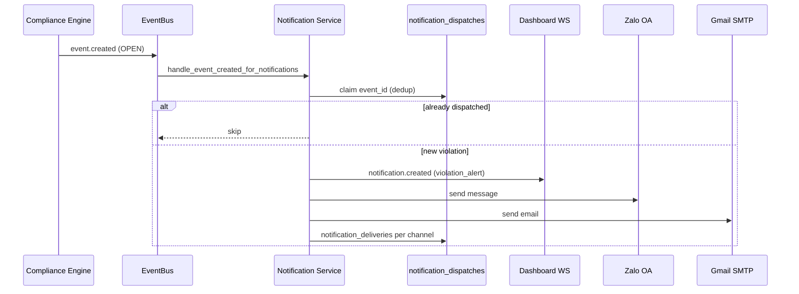

# Tự động gửi thông báo vi phạm ATSH — AMS v1.7

Tài liệu mô tả **Notification Service** bổ sung cho AMS: tự động cảnh báo khi Compliance Engine xác nhận vi phạm mới (OPEN).

**Phạm vi thay đổi:** Notification Service, API cấu hình, UI Settings, delivery log.

**Không thay đổi:** AI Detection, Rule Engine, Compliance Engine, Workflow Engine.

---

## Kiến trúc

```
AI Detection
    ↓
Rule Engine
    ↓
Compliance Engine
    ↓
Violation Created (OPEN) → event.created (EventBus)
    ↓
Violation Notification Service
    ├── 1. Dashboard (WebSocket notification.created)
    ├── 2. Zalo OA
    └── 3. Gmail (SMTP)
```

Hook duy nhất: subscriber `EVENT_CREATED` trong `violation_notification_service.py`.

Không sửa logic Compliance Engine — chỉ lắng nghe sự kiện đã publish.

---

## Luồng phát hiện

1. Observation → Rule/Compliance evaluation.
2. `create_compliance_violation_event()` hoặc `create_event_from_evaluation()` tạo `Event` với `status=OPEN`.
3. EventBus publish `event.created` kèm payload engine dict.
4. **Violation Notification Service** nhận message (không chạy khi reload UI / bootstrap).

---

## Luồng gửi thông báo



### Thứ tự gửi

| Bước | Kênh | Ghi chú |
|------|------|---------|
| 1 | **Dashboard** | Toast realtime qua WebSocket |
| 2 | **Zalo OA** | Bỏ qua nếu tắt hoặc thiếu cấu hình |
| 3 | **Gmail** | Bỏ qua nếu tắt hoặc thiếu SMTP |

Nếu một kênh lỗi, các kênh sau **vẫn tiếp tục**.

### Nội dung gửi

**Tiêu đề:** `🚨 CẢNH BÁO VI PHẠM AN TOÀN SINH HỌC`

**Nội dung:**

- Thời gian phát hiện
- Trang trại
- Camera
- Khu vực
- Quy tắc ATSH vi phạm
- Mức độ
- Mô tả vi phạm
- Liên kết mở AMS
- Snapshot / Video (nếu có)

---

## Điều kiện gửi

| Gửi | Không gửi |
|-----|-----------|
| Vi phạm **mới** qua `event.created` | Refresh trang |
| Trạng thái **OPEN** | Reload Dashboard bootstrap |
| ATSH / compliance / rule engine | Mở lịch sử vi phạm cũ |
| Mỗi `event_id` **một lần** | Chuyển sang RESOLVED |

---

## Chống gửi trùng

| Cơ chế | Bảng |
|--------|------|
| Claim theo `event_id` | `notification_dispatches` (PK = event_id) |
| Log theo kênh | `notification_deliveries` (unique event_id + channel) |

Nếu vi phạm vẫn OPEN nhưng đã dispatch → **không gửi lại**.

Vi phạm mới (event_id mới) → thông báo mới.

---

## Trạng thái gửi

Mỗi lần gửi kênh ghi vào `notification_deliveries`:

| Trường | Mô tả |
|--------|--------|
| `event_id` | Mã vi phạm |
| `channel` | dashboard / zalo / gmail |
| `status` | success / failed / skipped |
| `sent_at` | Thời gian gửi |
| `error_message` | Lỗi (nếu có) |

API: `GET /api/notifications/deliveries?event_id=...`

---

## Cấu hình

**Cài đặt → Thông báo vi phạm ATSH**

| Tùy chọn | Mô tả |
|----------|--------|
| Bật/Tắt Gmail | `gmail_enabled` |
| Bật/Tắt Zalo | `zalo_enabled` |
| Email nhận | `gmail_recipient` |
| Email gửi | `gmail_from` |
| OA Zalo ID | `zalo_oa_id` |
| User ID Zalo | `zalo_recipient_id` |
| Liên kết AMS | `ams_app_url` |

**API:**

- `GET /api/notifications/settings`
- `PUT /api/notifications/settings`
- `POST /api/notifications/test` — gửi thử từng kênh

**Biến môi trường (backend/.env):**

| Biến | Mục đích |
|------|----------|
| `SMTP_HOST`, `SMTP_PORT`, `SMTP_USER`, `SMTP_PASSWORD` | Gmail thật |
| `ZALO_OA_ACCESS_TOKEN` | Zalo OA API |

Nếu chưa cấu hình SMTP/Zalo trong `.env` → **Kết nối Gmail / Quét mã QR** trên UI sẽ báo lỗi rõ ràng (không gửi giả).

---

## File thay đổi

| File | Vai trò |
|------|---------|
| `backend/app/services/violation_notification_service.py` | Orchestrator + adapters |
| `backend/app/models/notification_delivery.py` | Log gửi theo kênh |
| `backend/app/models/notification_dispatch.py` | Dedup theo event |
| `backend/app/api/notifications.py` | Settings / deliveries / test |
| `backend/alembic/versions/0035_violation_notification_service.py` | Migration |
| `backend/app/services/pipeline_subscribers.py` | Tránh toast trùng cho ATSH |
| `src/pages/SettingsPage.jsx` | UI cấu hình |
| `src/services/notificationSettingsService.js` | API client |
| `src/providers/NotificationProvider.jsx` | Toast cảnh báo vi phạm |

---

## Kết quả kiểm thử

```bash
cd backend && .venv/bin/pytest tests/test_violation_notification_service.py -q
npm test -- --run
npm run build
```

| Kiểm tra | Kết quả mong đợi |
|----------|------------------|
| Tạo vi phạm OPEN mới | Dashboard toast ngay |
| Gửi Zalo/Gmail | Tự động theo thứ tự (sim nếu chưa cấu hình) |
| Gửi lại cùng event_id | Bị chặn bởi `notification_dispatches` |
| RESOLVED / reload | Không gửi |
| Zalo lỗi | Gmail vẫn gửi |
| `test_violation_notification_service.py` | PASS |

---

*TIN NGHIA AMS — Cảnh báo vi phạm ATSH tự động, một lần mỗi vi phạm.*
