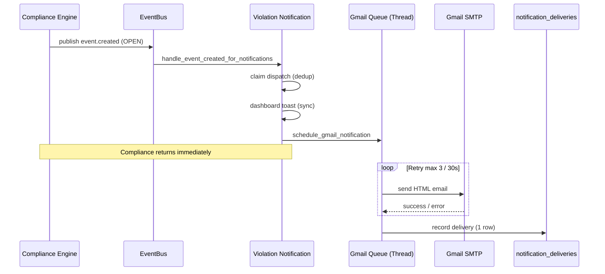

# Notification Center v1.8 — Production

AMS v1.8 biến Notification Center thành trung tâm cảnh báo thống nhất qua **Gmail tự động** khi Compliance Engine xác nhận vi phạm OPEN.

**Phạm vi:** Gmail cảnh báo vi phạm, delivery log, dashboard widget, cài đặt.  
**Không triển khai:** SMS, Zalo (UI legacy giữ nguyên), báo cáo định kỳ, digest email.

Rule Engine, Compliance Engine, Workflow Engine — **không thay đổi logic nghiệp vụ**.

---

## Luồng hoạt động

```
AI / Rule Engine
      ↓
Compliance Engine (vi phạm OPEN mới)
      ↓
EventBus: event.created
      ↓
Violation Notification Service
      ├── Dashboard toast (sync)
      └── Gmail (background thread)
              ├── Retry tối đa 3 lần / 30s
              └── notification_deliveries (1 bản ghi / violation)
```

### Điều kiện gửi Gmail

| Gửi | Không gửi |
|-----|-----------|
| `status = OPEN` (Compliance) | `IN_PROGRESS`, `RESOLVED`, `DISMISSED`, `ACKNOWLEDGED` |
| `category = compliance_violation` hoặc `metadata.source = compliance_engine` | Rule-engine-only, workflow-only |
| `gmail_enabled` + `gmail_connected` | Ephemeral / test events |

---

## Kiến trúc

| Thành phần | File |
|------------|------|
| Subscriber | `app/services/violation_notification_service.py` |
| Gmail SMTP + HTML | `app/services/gmail_notification_service.py` |
| API Settings / test | `app/api/notification.py`, `app/api/notifications.py` |
| Delivery log | `app/models/notification_delivery.py` |
| Dedup dispatch | `app/models/notification_dispatch.py` |
| Dashboard stats | `app/services/dashboard_bootstrap_service.py` |
| Frontend widget | `src/components/dashboard/GmailDeliveryWidget.jsx` |
| Settings UI | `src/pages/SettingsPage.jsx` |

---

## Email nội dung

**Tiêu đề:** `🚨 CẢNH BÁO VI PHẠM AN TOÀN SINH HỌC`

**Nội dung:**

- Trang trại
- Camera
- Khu vực
- Thời gian
- Loại vi phạm
- Mức độ
- Ảnh vi phạm (inline) hoặc «📷 Chưa có hình ảnh.»
- Nút **Mở AMS**

**Không hiển thị:** event_id, violation_id, camera_id, JSON, thông tin kỹ thuật.

---

## Chống gửi trùng

1. `notification_dispatches` — PK `event_id`, claim một lần.
2. `notification_deliveries` — unique `(event_id, channel)`.
3. Background worker kiểm tra lại trước khi gửi.

Một violation → **đúng 1 email Gmail** (thành công hoặc failed sau retry).

---

## Retry

| Tham số | Giá trị |
|---------|---------|
| Số lần thử | 3 |
| Khoảng cách | 30 giây |
| Ghi log | 1 dòng `notification_deliveries` sau lần cuối |

Hàm: `send_gmail_notification_with_retry()` trong `violation_notification_service.py`.

---

## Queue (Background Task)

Gmail chạy trong `threading.Thread(daemon=True)` — **không block** Compliance / Rule / AI pipeline.

Counter `get_pending_gmail_count()` phục vụ dashboard «Đang chờ».

---

## SMTP

Đọc từ `backend/.env` (ưu tiên `os.environ` trong Docker):

```env
SMTP_HOST=smtp.gmail.com
SMTP_PORT=587
SMTP_USER=...
SMTP_PASSWORD=...
```

Timeout SMTP: 10 giây / lần thử.

---

## Notification Delivery

Bảng `notification_deliveries`:

| Cột | Ý nghĩa |
|-----|---------|
| `sent_at` | Thời gian gửi |
| `recipient` | Email nhận |
| `subject` | Loại cảnh báo (tiêu đề email) |
| `status` | `success` / `failed` |
| `error_message` | Lỗi (nếu có) |
| `smtp_latency_ms` | Thời gian phản hồi SMTP |

API lịch sử: `GET /api/notifications/deliveries`

---

## Dashboard widget

Bootstrap `notificationSummary.gmail`:

- `sentToday` — đã gửi hôm nay
- `pending` — đang chờ (queue + dispatch chưa có delivery)
- `errorsToday` — lỗi hôm nay
- `lastSentAt` — lần gửi cuối

Component: `GmailDeliveryWidget` trên Dashboard.

---

## Cài đặt (Settings)

- ✓ Gmail đã kết nối
- Email gửi (`gmail_sender` từ SMTP)
- Email nhận
- **Kiểm tra kết nối** → `POST /api/notification/gmail/verify`
- **Gửi Email thử** → `POST /api/notification/gmail/test`
- **Lưu cấu hình**

---

## Sequence Diagram



---

## Kiểm thử

### Backend

```bash
cd backend
python -m pytest tests/test_gmail_notification_service.py \
  tests/test_violation_notification_service.py \
  tests/test_notification_production.py \
  tests/test_dashboard_bootstrap.py -q
```

### Frontend

```bash
npm test
```

### Luồng giả lập

1. Cấu hình SMTP + kết nối Gmail trong Settings
2. Tạo vi phạm giả (Compliance OPEN) hoặc `POST /api/notification/send`
3. Kiểm tra: email đến, không trùng, có snapshot/placeholder, có log delivery

### Docker

```bash
cd backend && docker compose ps
curl -s http://127.0.0.1:8000/api/health | jq .status
```

---

## Files thay đổi v1.8

| File | Thay đổi |
|------|----------|
| `violation_notification_service.py` | Retry, IN_PROGRESS filter, pending counter, violation_type |
| `gmail_notification_service.py` | Email template v1.8, snapshot placeholder |
| `dashboard_bootstrap_service.py` | Gmail channel stats |
| `notification.py` | `POST /gmail/verify` |
| `GmailDeliveryWidget.jsx` | Dashboard widget |
| `SettingsPage.jsx` | Gmail production UI |
| `notificationSettingsService.js` | verifyGmail API |
