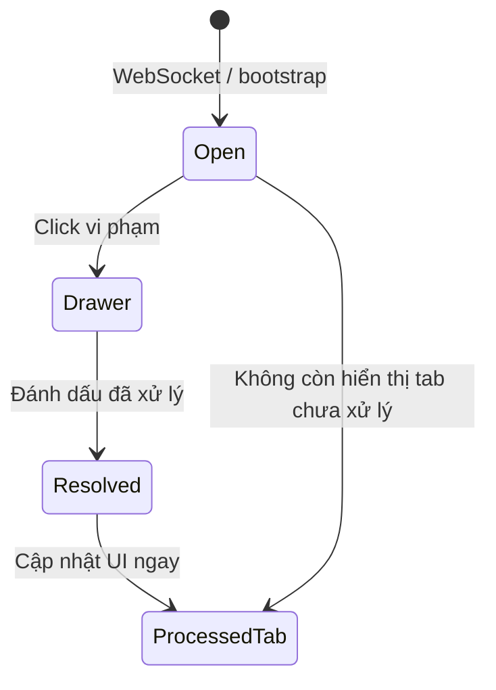

# Trung tâm vi phạm AMS v1.7

Tài liệu mô tả hợp nhất **Sự kiện** và **Vi phạm ATSH** thành một trung tâm quản lý vi phạm duy nhất.

**Phạm vi:** Sidebar, Dashboard, UI, tổ chức dữ liệu phía client.

**Không thay đổi:** Backend, API, Database, Event Pipeline, WebSocket, Compliance Engine, Workflow Engine, Rule Engine.

---

## Kiến trúc mới

```
Sidebar
└── Vi phạm ATSH (/vi-pham-atsh)
    ├── Tab: Vi phạm chưa xử lý (mặc định)
    │   ├── Panel Vi phạm trực tiếp (WebSocket)
    │   └── Danh sách vi phạm mock/API chưa xử lý
    └── Tab: Vi phạm đã xử lý
        └── Lịch sử + tìm kiếm + bộ lọc

Mọi trang (sidebar phải)
└── Panel Vi phạm trực tiếp (thu gọn, chỉ vi phạm OPEN)

Click vi phạm → Drawer Trung tâm xử lý vi phạm (không chuyển trang)
```

### Đã loại bỏ

- Tab **Sự kiện** trong trang Vi phạm ATSH
- Tab **Bằng chứng** riêng (bằng chứng nằm trong drawer)
- Menu Sidebar **Sự kiện** (không tồn tại ở cấp 1)
- Route `/events` → redirect `/vi-pham-atsh`

---

## Luồng xử lý



1. Sự kiện realtime đến qua **WebSocket** → `EventStore` (không đổi).
2. `ViolationProcessingContext` lọc chỉ vi phạm **OPEN** (chưa xử lý / chưa báo giả).
3. Người dùng mở drawer, xem bằng chứng, ghi chú.
4. **Đánh dấu đã xử lý** → trạng thái local `RESOLVED` (override theo `id`).
5. Vi phạm **biến mất** khỏi tab chưa xử lý và panel trực tiếp; **xuất hiện** tab đã xử lý.
6. Bộ đếm Dashboard / KPI cập nhật ngay — không refresh.

*Ghi chú Pilot:* Trạng thái xử lý lưu trong bộ nhớ client (`ViolationProcessingContext.overrides`), chưa gọi API cập nhật.

---

## Giao diện

### Dashboard / Sidebar phải

| Trước | Sau |
|-------|-----|
| Sự kiện trực tiếp | **Vi phạm trực tiếp** |
| Đếm tất cả sự kiện hôm nay | Chỉ **vi phạm chưa xử lý** hôm nay |

### Trang Vi phạm ATSH

| Tab | Nội dung |
|-----|----------|
| **Vi phạm chưa xử lý** | Panel WS thu gọn/mở rộng + thẻ vi phạm |
| **Vi phạm đã xử lý** | Lịch sử, tìm kiếm, lọc, người xử lý, ghi chú, thời gian xử lý |

### Drawer xử lý

Giữ nguyên spec v1.7: thông tin chung, đối tượng, bằng chứng, timeline, độ tin cậy AI, trạng thái, ghi chú, nút hành động.

---

## Luồng WebSocket

```
Backend WS (/ws/events)
    ↓
wsClient.subscribeWsEvents
    ↓
EventStore (normalizeWsPayload, upsertEvent)
    ↓
ViolationProcessingContext (lọc isViolationOpen)
    ↓
CollapsibleRealtimeEventPanel + Drawer
```

Không thêm nguồn dữ liệu mới. Không sửa Event Pipeline.

---

## Xác nhận không ảnh hưởng Backend/API

| Hạng mục | Ảnh hưởng |
|----------|-----------|
| Backend / API | **Không đổi** |
| Database | **Không đổi** |
| WebSocket | **Không đổi** |
| EventStore | **Không đổi** — chỉ lọc hiển thị phía UI |
| Route | `/vi-pham-atsh`, `/events` redirect — **không xóa route** |

### File thay đổi (frontend)

| File | Vai trò |
|------|---------|
| `src/context/ViolationProcessingContext.jsx` | Trạng thái OPEN/RESOLVED, metrics |
| `src/utils/violationStatus.js` | Helper lọc trạng thái |
| `src/pages/ViolationsPage.jsx` | 2 tab hợp nhất |
| `src/components/violations/ProcessedViolationsPanel.jsx` | Tab đã xử lý |
| `src/components/realtime/CollapsibleRealtimeEventPanel.jsx` | Đổi tên + lọc OPEN |
| `src/pages/EventsPage.jsx` | Redirect |
| `src/main.jsx` | Provider order |

---

## Kiểm tra

```bash
npm test -- --run
npm run build
cd backend && pytest
```

---

*TIN NGHIA AMS — Một trung tâm vi phạm duy nhất.*
