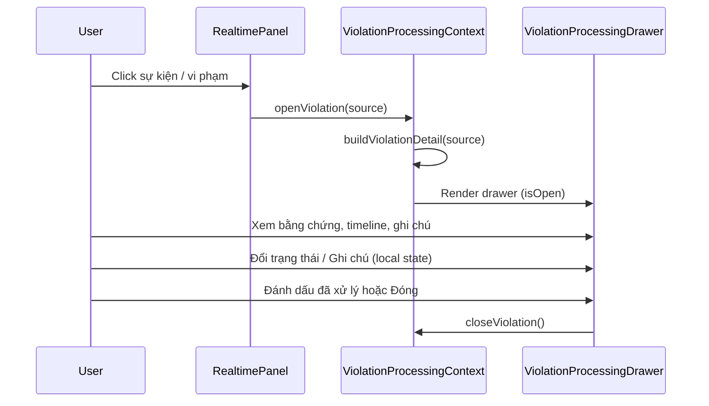

# Violation Detail Panel — Trung tâm xử lý vi phạm

Tài liệu mô tả drawer xử lý vi phạm AMS v1.7 khi người dùng nhấn vào sự kiện/vi phạm trực tiếp.

**Phạm vi:** Chỉ giao diện và cách hiển thị dữ liệu hiện có.

**Không thay đổi:** Backend, API, Database, Event Pipeline, WebSocket, Compliance Engine, Workflow Engine, Rule Engine.

---

## Thiết kế giao diện

### Vị trí

- **Drawer bên phải**, rộng **460px** (tối đa full màn hình mobile).
- Mở khi click vi phạm từ:
  - Panel **Sự kiện trực tiếp** (mọi trang)
  - Danh sách **Vi phạm ATSH**
- **Không chuyển trang** — route `/vi-pham-atsh/:id` vẫn tồn tại cho bookmark.

### Hiệu ứng

- Overlay mờ ~28% — không che toàn bộ dashboard.
- Slide-in **280ms**, fade backdrop **250ms**.
- Đóng bằng: nút **X**, nút **Đóng**, click overlay, phím **ESC**.

### Cấu trúc drawer

| Khối | Nội dung |
|------|----------|
| Header | Tiêu đề *Trung tâm xử lý vi phạm* + loại vi phạm |
| Thông tin chung | Mã, thời gian, mức độ, trạng thái, camera, khu vực, quy tắc ATSH |
| Đối tượng vi phạm | Người / Xe / Động vật (theo loại sự kiện) |
| Bằng chứng | Snapshot, video, khung AI, thời gian ghi nhận, phóng to ảnh |
| Diễn biến | Timeline các bước |
| Đánh giá | Độ tin cậy AI (%) |
| Trạng thái xử lý | Chưa xử lý · Đang xử lý · Đã xử lý · Báo động giả |
| Ghi chú | Textarea ghi chú xử lý (local UI) |
| Footer | Xem Camera · Mở ảnh · Mở video · Đánh dấu đã xử lý · Đóng |

---

## Các trường dữ liệu

Dữ liệu lấy từ `EventStore` (sự kiện engine) hoặc mock/API vi phạm ATSH, qua `buildViolationDetail()`:

| Trường UI | Nguồn |
|-----------|--------|
| Mã vi phạm | `event.id` |
| Thời gian | `occurredAt` / `date` + `time` |
| Mức độ | `severity` / `severityRaw` |
| Trạng thái | `status` (map sang nhãn tiếng Việt) |
| Camera | `cameraName`, `cameraId` |
| Khu vực | `zoneName` / `zone` |
| Quy tắc ATSH | `ruleName` / `typeLabel` |
| Track ID | `metadata.track_id` |
| Đồng phục | `metadata.uniform` |
| Snapshot | `snapshotPath` → URL qua `resolveSnapshotUrl` |
| Video | `metadata.video_url` (nếu có) |
| Timeline | `metadata.timeline` hoặc timeline Pilot sinh từ loại vi phạm |
| Độ tin cậy | `confidence` |

Nếu thiếu dữ liệu → hiển thị **"Chưa có dữ liệu"**.

---

## Luồng xử lý



1. Người dùng click vi phạm → drawer mở ngay trên trang hiện tại.
2. Quản lý xem thông tin, bằng chứng, timeline, độ tin cậy.
3. Cập nhật trạng thái / ghi chú **chỉ trên UI** (Pilot — chưa gọi API).
4. **Xem Camera** → `/monitoring/:cameraId`.
5. **Mở ảnh** → phóng to trong overlay; **Mở video** → tab mới nếu có URL.

---

## Xác nhận không thay đổi Backend/API

| Hạng mục | Ảnh hưởng |
|----------|-----------|
| Backend / API | **Không đổi** |
| Database | **Không đổi** |
| WebSocket / Event Pipeline | **Không đổi** — vẫn đọc `EventStore` |
| Route | **Không đổi** — trang chi tiết `/vi-pham-atsh/:id` vẫn hoạt động |

### File thay đổi (frontend)

| File | Vai trò |
|------|---------|
| `src/utils/violationDetailModel.js` | Chuẩn hóa dữ liệu hiển thị |
| `src/context/ViolationProcessingContext.jsx` | State mở/đóng drawer |
| `src/components/violations/ViolationProcessingDrawer.jsx` | Giao diện drawer |
| `src/App.jsx` | Bọc `ViolationProcessingProvider` |
| `src/components/realtime/CollapsibleRealtimeEventPanel.jsx` | Click mở drawer |
| `src/pages/ViolationsPage.jsx` | Click thẻ vi phạm mở drawer |
| `src/styles/ams-extensions.css` | Style drawer |

---

## Kiểm tra

```bash
npm test -- --run
npm run build
```

- Build và test frontend pass.
- WebSocket vẫn cập nhật sự kiện; click mở drawer không reload trang.

---

*TIN NGHIA AMS — AI giám sát an toàn sinh học trang trại heo.*
